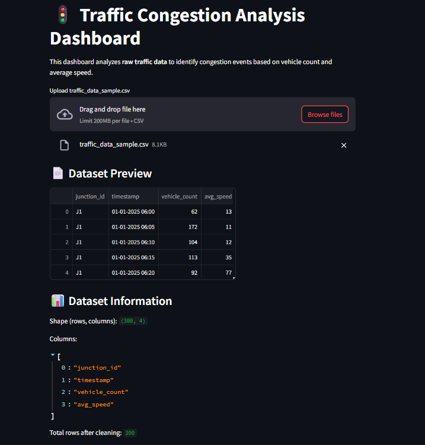
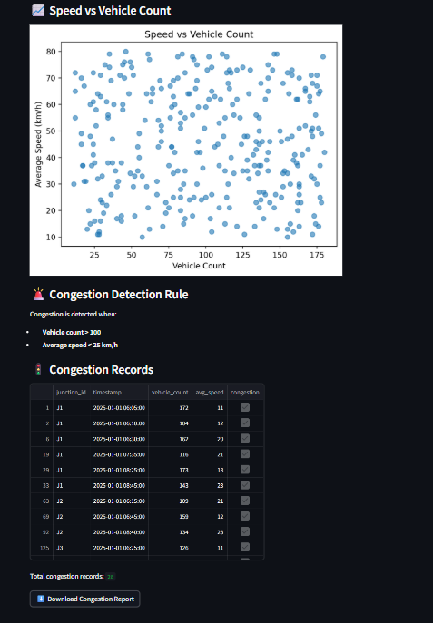

# 🚦 Traffic Congestion Analysis using Python & Streamlit


---

## 📌 Project Overview

This project analyzes traffic data to detect congestion conditions using vehicle count and average speed.  
It combines Exploratory Data Analysis (EDA), rule-based congestion detection, an interactive Streamlit dashboard, and a simple Logistic Regression machine learning extension.

---

## 🎯 Project Objectives

- Analyze traffic dataset
- Identify congestion using domain-based thresholds
- Visualize traffic patterns
- Generate downloadable congestion report
- Deploy interactive dashboard using Streamlit
- Validate approach using Logistic Regression

---

## 📂 Dataset Details

- **Total Records:** 300  
- **Features:**
  - `timestamp`
  - `vehicle_count`
  - `avg_speed`

Cleaned dataset is used for congestion detection after preprocessing.

---

## ⚙️ Methodology

### 1️⃣ Data Preprocessing
- Converted `timestamp` to datetime
- Removed invalid values
- Filtered unrealistic speed values

### 2️⃣ Exploratory Data Analysis
- Scatter Plot: Speed vs Vehicle Count
- Observed inverse relationship between traffic volume and speed

### 3️⃣ Congestion Detection Rule

Traffic is classified as **congested** when:

- `vehicle_count > 100`
- `avg_speed < 25 km/h`

Congestion records are exported as:

```
congestion_report.csv
```

### 4️⃣ Streamlit Dashboard

The Streamlit app allows users to:

- Upload traffic CSV file
- View cleaned dataset
- Detect congestion automatically
- Download congestion report

Run the app using:

```bash
streamlit run app.py
```

### 5️⃣ Machine Learning Extension

A Logistic Regression model was implemented to:

- Predict congestion (Yes / No)
- Validate rule-based detection
- Evaluate performance using confusion matrix

---

## 📈 Results

- Congestion events successfully identified
- Interactive dashboard deployed
- Logistic Regression confirmed congestion patterns
- Project demonstrates effective rule-based traffic analysis

---

<h2 align="center">🖥 Streamlit Dashboard Preview</h2>

<p align="center">
  
  
</p>

---

## 📌 Final Conclusion

This project successfully identified traffic congestion using rule-based analysis supported by exploratory data visualization.  
An interactive Streamlit dashboard was developed to make the system user-friendly and practical.  
Additionally, a Logistic Regression model validated the congestion detection logic, confirming the reliability of the approach.

---

## 🛠 Technologies Used

- Python
- Pandas
- Matplotlib
- Scikit-learn
- Streamlit

---

## 🚀 How to Run Locally

### 1️⃣ Clone the repository

```bash
git clone https://github.com/nighithatn/Traffic-Congestion-Analysis.git
```

### 2️⃣ Install dependencies

```bash
pip install -r requirements.txt
```

### 3️⃣ Run Streamlit app

```bash
streamlit run app.py
```

---

## 👩‍💻 Author

Nighitha T. N.

---

### ⭐ If you found this project interesting, feel free to star the repository!
